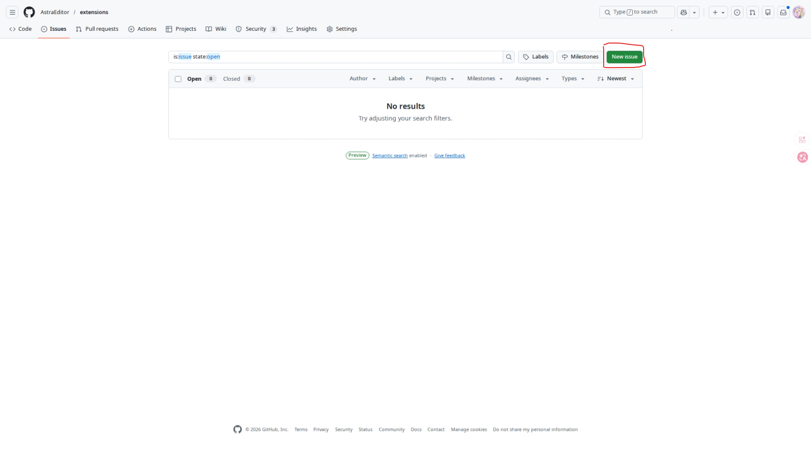
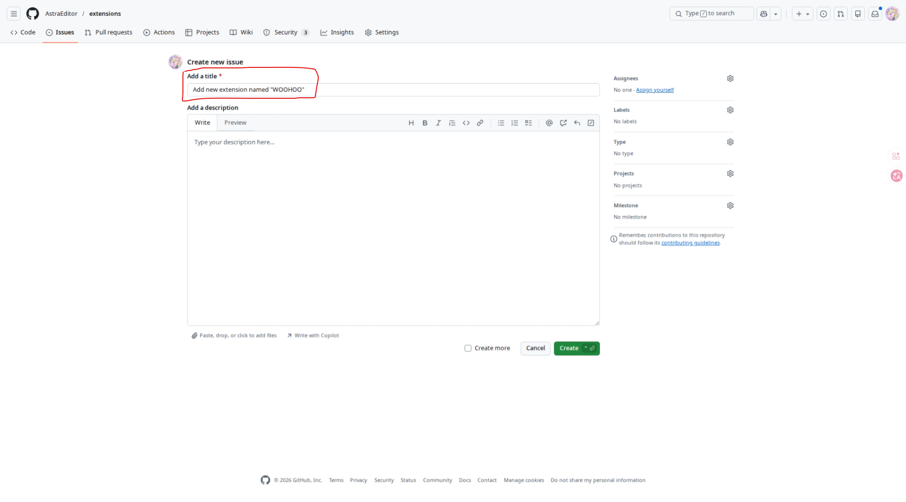
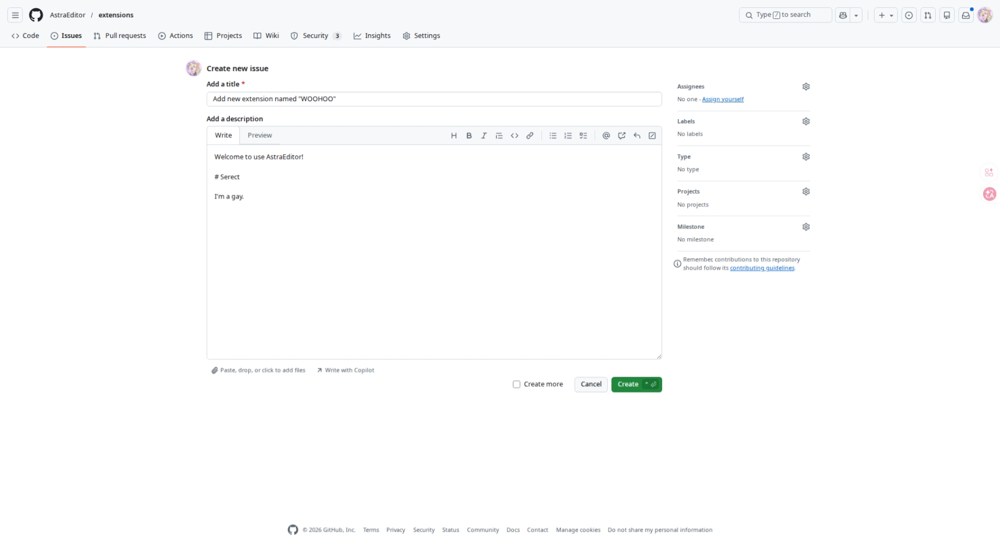
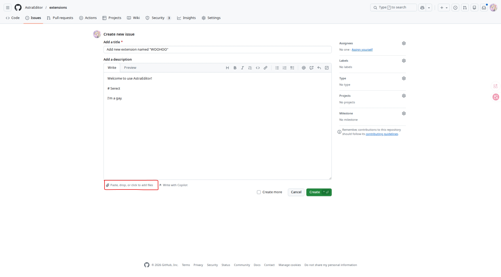
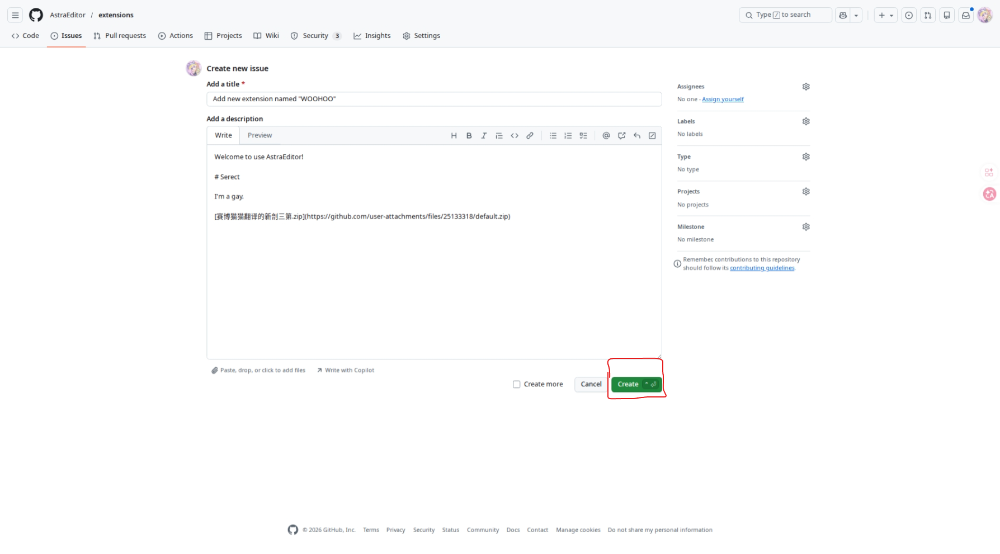

# 为AstraEditor提交扩展

## 须知
我们采取 **“issues”** 的方式让您更方便的提交扩展。
这需要你在提交扩展前有一个 **Github账号** ，对于如何注册，请自行百度，这里不再赘述。

## 准备
### 审核
在您提交一个扩展前，务必确保您的扩展 **可以正确运行** 。我们会对您提交的扩展展开*审核*，包括但不限于：
* 扩展可以正确加载
* 所有添加的积木均可正确使用
* 不包含关于**歧视、污秽语言、网络烂梗**等语言、功能
* 没有过分的**AI程度**（100%由AI制作）

审核的日期不定，但大多都能在**一周内**审核完成，请及时关注结果。

### 打包
您需要保证您提交的文件可以**让别人看懂**。我们规定了一个简单的目录，方便你我更快的检查和加入您的扩展：
``` python
扩展名.zip
    |- main.js      #您的扩展文件
    |- featured.png #扩展的头图，在扩展库显示
    |- text.json    #存放您的扩展信息
```
如果您提交的*不满足*我们的要求，我们可能会**拒绝加入**您的扩展。

下面我们会展开每个文件具体的规范。

#### main.js
这里存放您的扩展主文件，具体扩展该如何编写请参考*其它扩展教程*。

说回来，您的扩展开头应有以下内容：
``` js
// Name: 扩展名称
// ID: 扩展ID
// Description: 扩展描述
// By: 作者（你的名字）
// License: 许可证（MIT、GPLv3等）
```
这*在此扩展库* 并**不是强制的**，但是我们仍建议您在扩展开头加上这一串，这对其它人/事有**很大的帮助**。

此外，我们*不要求您的内容包含国际化* 。

#### featured.png
这里是扩展的头图，也就是在扩展库展示的图片。
我们*硬性* 要求扩展图满足以下条件：
* 纵横比为 2:1
* 分辨率各不小于 600x300
* 有一个明确的代表，无论文字或图形（你甚至可以只写个扩展名上去）

我们也*建议* 您的扩展图可以：
* 不单调
* 美观（参考TurboWarp及其他扩展库扩展）
* 有一个**明确清晰**的主题色而不是*炸裂非主流的渐变和AI生成*

#### text.json
您可以复制这个示例并对其修改
```json
{
    "Name":{
        "en-us":"Extension Name",
        "zh-cn":"扩展名"
    },
    "Description":{
        "en-us":"Extension Description",
        "zh-cn":"扩展描述"
    },
    "Author":[
        {"name":"您的名字","link":"您的个人页面"},{"name":"名字","link":"个人页面"}
    ],
}
```
我们**硬性要求**您的扩展格式至少包含以上三项，且`Name`和`Description`包含`en-us`。这对国际化很有帮助。

我们*不要求您的扩展内容包含国际化*。
## 准备
### Issues

如上，我们使用**Issues**来作为提交介质。我们将展开提交步骤。

#### 1.进入 Extensions库——Issues

进入此链接
[https://github.com/AstraEditor/extensions/issues](https://github.com/AstraEditor/extensions/issues)

#### 2.发送 Issue

点击**New issue**。

在**Add a title**下面的*输入框*输入类似
`Add new extension named "扩展名"`的文字让我们识别。

在**Add a description**处输入您想要告诉我们的信息，这不是必要的。

点击下方写着**Paste, drop, or click to add files**的按钮，导入您制作好的扩展文件（.zip）

等待导入完成，点击**Create**！


完成！现在只需等待我们进行审核并回复您！